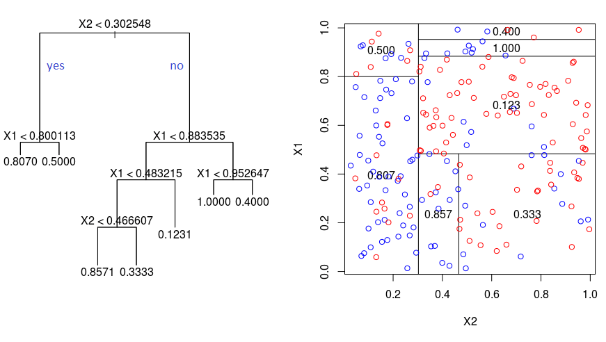

# Árboles de regresión {#arb-de-regre}
Los árboles de regresión/clasificación fueron propuestos par [Leo Breiman](https://en.wikipedia.org/wiki/Leo_Breiman) en el libro [@Breiman1984] y son árboles de decisión que tienen como objetivo asignar un valor de $\hat{y}$ dependiendo de los valores de las covariables.

Los árboles se pueden clasificar en dos tipos que son:

1. Árboles de regresión en los cuales la variable respuesta $y$ es cuantitativa.
2. Árboles de clasificación en los cuales la variable respuesta $y$ es cualitativa.

El presente capítulo está destinado a árboles de regresión, los árboles de clasificación se explican en el capítulo \@ref(arb-de-clasif).

Un árbol de regresión consiste en hacer preguntas de tipo ¿$x_k \leq c$? para cada una de las covariables, de esta forma el espacio de las covariables es divido en hiper-rectángulos y todas las observaciones que queden dentro de un hiper-rectángulo tendrán el mismo valor estimado $\hat{y}$.

En la siguiente figura se ilustra el árbol en el lado izquierdo y la partición del espacio en el lado derecho. La partición del espacio se hace de manera repetitiva para encontrar las variables y los valores de corte $c$ de tal manera que se minimice la función de costos $\sum_{i=1}^{i=n} (y_i - \hat{y}_i)^2$.

```{r ilustra-arbol-reg01, echo=F, fig.cap='Ilustración de la técnica Árboles de Regresión. A la izquierda el árbol y a la derecha la partición del espacio.', dpi=40, fig.align='center'}

```

Los pasos para realizar la partición del espacio son:

1. Dado un conjunto de covariables (características), encontrar la covariable que permita predecir mejor la variable respuesta.
2. Encontrar el punto de corte $c$ sobre esa covariable que permita predecir mejor la variable respuesta.
3. Repetir los pasos anteriores hasta que se alcance el criterio de parada.

Algunas de las ventajas de los árboles de regresión son:

- Fácil de entender e intrepretar.
- Requiere poca preparación de los datos.
- Las covariables pueden ser cualitativas o cuantitativas.
- No exige supuestos distribucionales.

Para explicaciones más detalladas sobre las técnicas basadas en árboles recomendamos consultar el capítulo 8 de [@james2013]. Se recomienda también ver [este video](https://www.youtube.com/watch?v=7VeUPuFGJHk) con una explicación sencilla sobre árboles.


## Paquetes {-}
En esta sección se mencionan algunos de los paquetes más comunes para implementar árboles de regresión.

El paquete **rpart** [@R-rpart] es uno de los paquetes que se pueden usar para crear árboles de regresión. La función para crear un árbol de regresión es `rpart`, a continuación la estructura de la función.

```{r, eval=FALSE}
rpart(formula, data, weights, subset, na.action = na.rpart, method,
      model = FALSE, x = FALSE, y = TRUE, parms, control, cost, ...)
```

Otro paquete útil para árboles de regresión es **tree** [@R-tree]. La función para crear un árbol de regresión es `tree`, a continuación la estructura de la función.

```{r, eval=FALSE}
tree(formula, data, weights, subset,
     na.action = na.pass, control = tree.control(nobs, ...),
     method = "recursive.partition",
     split = c("deviance", "gini"),
     model = FALSE, x = FALSE, y = TRUE, wts = TRUE, ...)
```

```{block2, type='rmdnote'}
Se recomienda al lector que consulte la ayuda de las funciones anteriores para que pueda entender las posibilidades que se tienen con cada una de ellas.
```

## Ejemplo con el paquete **rpart** {-}
En este ejemplo se busca encontrar un modelo de regresion lineal que explique la variable respuesta $y$ en función de las covariables $x_1$ a $x_{11}$, los datos provienen del ejercicio 9.5 del libro de [Montgomery, Peck and Vining (2003)](https://www.amazon.com/Introduccion-analisis-regresion-lineal-Spanish/dp/9702403278). El paquete **MPV** [@R-MPV] contiene todos los datos que acompañan al libro.

A continuación se muestra el encabezado de la base de datos y la definición de las variables.

```{r selection02, echo=F, fig.cap='Ilustración de la base de datos.', dpi=40, fig.align='center'}
knitr::include_graphics("images/tableb3.png")
```

__Nota__: Type of transmission (1=automatic, 0=manual).

Antes de iniciar es necesario revisar si hay `NA's` y eliminarlos.

```{r, message=F}
library(MPV)  # Aqui estan los datos
table.b3[22:26, ] # Can you see the missing values?
datos <- table.b3[-c(23, 25), ]
```

El objeto `datos` tiene la base de datos sin las líneas con `NA`, lo mismo se hubiese podido realizar usando la función `na.omit`. La base de datos tiene `r nrow(datos)` filas y `r ncol(datos)` columnas.

```{r, message=FALSE}
library(rpart)
library(rpart.plot)
```

```{r}
mod1 <- rpart(y ~ ., data=datos)
```

Dibjuemos el árbol con `prp` que es una función del paquete **rpart.plot** [@R-rpart.plot].

```{r arbol01, fig.align='center', fig.height=3, fig.width=6}
prp(mod1)
```

Construyamos nuevamente el árbol pero explorando todas las opciones de la función `prp`.

```{r arbol02, fig.align='center', fig.height=3, fig.width=6}
prp(mod1, main="",
    nn = TRUE,             # display the node numbers
    fallen.leaves = TRUE,  # put the leaves on the bottom of the page
    shadow.col = "gray",   # shadows under the leaves
    branch.lty = 3,        # draw branches using dotted lines
    branch = .5,           # change angle of branch lines
    faclen = 0,            # faclen = 0 to print full factor names
    trace = 1,             # print the auto calculated cex, xlim, ylim
    split.cex = 1.2,       # make the split text larger than the node text
    split.prefix = "is ",  # put "is " before split text
    split.suffix = "?",    # put "?" after split text
    split.box.col = "lightblue",   # lightgray split boxes (default is white)
    split.border.col = "darkgray", # darkgray border on split boxes
    split.round = 0.5)             # round the split box corners a tad
```

Usando la información del árbol anterior es posible predecir el valor de $y$. Por ejemplo:

1. Si una nueva observación tiene $x_9=70$ y $x_2=100$, entonces $\hat{y}=20$.
2. Si otra observación tiene $x_9=60$ y $x_2=150$, entonces $\hat{y}=28$.

Como en el árbol anterior solo aparecen las variables $x_2$ y $x_9$ se recomienda volver a construir el árbol sólo con ellas.

```{r}
mod1 <- rpart(y ~ x2 + x9, data=datos)
```

Este árbol por tener solo dos covariables se puede representar de la siguiente forma:

```{r arbol03, fig.align='center', fig.height=4, fig.width=4}
with(datos, plot(x=x2, y=x9))
abline(h=66, lty='dashed', col='blue')
segments(x0=144, y0=66, x1=144, y1=82, lty='dashed', col='blue')
text(x=120, y=63, labels='y=28', col=4)
text(x=90, y=73, labels='y=20', col=4)
text(x=190, y=73, labels='y=16', col=4)
```


Para predecir los valores de $y$ se puede usar la función `predict`. A continuación el código para predecir la respuesta en los dos casos anteriores.

```{r}
nuevos_datos <- data.frame(x2=c(100, 150), x9=c(70, 60))
predict(object=mod1, newdata=nuevos_datos)
```

En este ejemplo los datos originales se usaron como conjunto de entrenamiento y prueba debido a que solo se cuentan con `r nrow(datos)` observaciones.

Entre más cerca estén las $\hat{y}$ de los $y$ observados se puede decir que el modelo es mejor. A continuación la correlación entre $\hat{y}$ y $y$.

```{r}
y_hat <- predict(object=mod1, newdata=datos)
cor(y_hat, datos$y)
```

¿Qué opina de este valor?

A continuación un diagrama de dispersión entre $\hat{y}$ y $y$.

```{r arbol04, fig.align='center', fig.height=4, fig.width=4}
plot(x=datos$y, y=y_hat, pch=20, las=1, xlab='y', ylab=expression(hat(y)))
abline(a=0, b=1, lty="dashed", col="blue")
```

## Ejemplo con el paquete **tree** {-}
Aquí vamos a repetir el ejemplo anterior con otro paquete.

```{r}
library(tree)
mod2 <- tree(y ~ ., data=datos)
```

Para dibujar el árbol se puede usar las siguientes instrucciones.

```{r tree01, fig.align='center', fig.height=4, fig.width=6}
plot(mod2)
text(mod2, pretty=0)
```

Entre más cerca estén las $\hat{y}$ de los $y$ observados se puede decir que el modelo es mejor. A continuación la correlación entre $\hat{y}$ y $y$.

```{r}
y_hat <- predict(object=mod2, newdata=datos)
cor(y_hat, datos$y)
```
