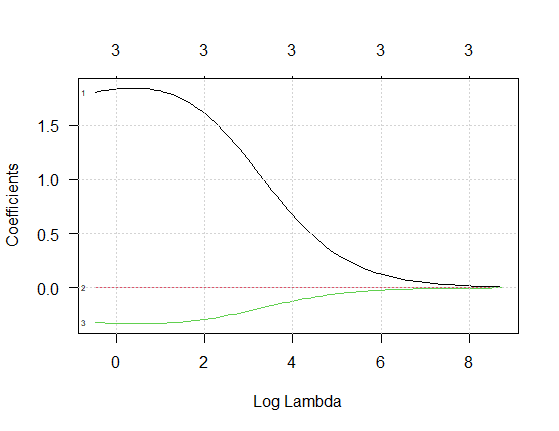
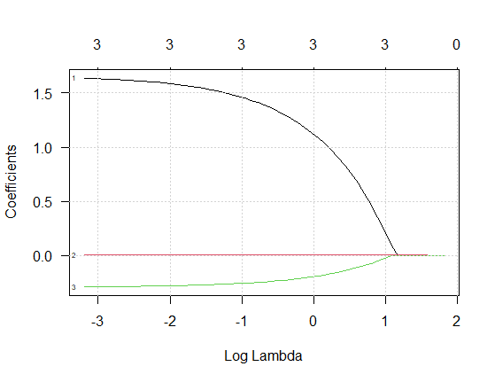

# Regularización {#regula}

En esta sección se presentan las técnicas de regularización ampliamente utilizadas en regresión: **Ridge** y **Lasso**. Ambas buscan mejorar la capacidad predictiva del modelo penalizando la magnitud de los coeficientes.

Se utilizará la base de datos `mtcars` de R, considerando como máximo 4 variables predictoras.

## Regresión de mínimos cuadrados {-}

El principio de mínimos cuadrados proporciona una forma de elegir los coeficientes de manera eficiente, minimizando la suma de los errores al cuadrado. Es decir, elegimos los valores de $\beta_{0}, \beta_{1},...\beta_{p}$ que minimizan

$$
RSS =\sum_{i=1}^{n}\left( y_{i}-\beta_0 - \sum_{j=1}^p \beta_j x_{ij} \right)^2 
$$

## Regresión Ridge {-}

La regresión Ridge es muy similar a la regresión por mínimos cuadrados, excepto que los coeficientes son estimados minimizando una cantidad ligeramente diferente. En particular, las estimaciones de los coeficientes de regresión Ridge, $\hat{\beta}^{R}$, son los valores que minimizan

$$
\sum_{i=1}^{n}\left( y_{i}-\beta_0 - \sum_{j=1}^p \beta_j x_{ij} \right)^2 + \lambda \sum_{j=1}^p \beta_{j}^{2} = RSS + \lambda \sum_{j=1}^p \beta_{j}^{2}
$$

donde $\lambda \geq 0$ es un $\color{red}{\text {parámetro de ajuste}}$, el cual debe determinarse por separado, y $\lambda \sum_{j=1}^p \beta_{j}^{2}$ se denomina una $\color{red}{\text {penalización de contracción}}$ (shrinkage penalty).

Note que en la ecuación, la penalización de contracción se aplica a $\beta_1,..., \beta_p$, pero no al intercepto $\beta_0$.

En la siguiente figura se ilustra lo que sucede con los parámetros a medida que aumenta $\log(\lambda)$:

<p align="center">
  
</p>

Ventajas

- Reduce la varianza del modelo.
- Funciona bien cuando hay multicolinealidad.
- Estabiliza estimaciones.

Desventajas

- No realiza selección de variables.
- Todos los predictores permanecen en el modelo.

Para ajustar un modelo de regresión Ridge se usa la siguiente función del paquete **glmnet** de @R-FNN:

```{r, eval=FALSE}
glmnet(
  x,
  y,
  family = c("gaussian", "binomial", "poisson", "multinomial", "cox", "mgaussian"),
  weights = NULL,
  offset = NULL,
  alpha = 1,
  nlambda = 100,
  lambda.min.ratio = ifelse(nobs < nvars, 0.01, 1e-04),
  lambda = NULL,
  standardize = TRUE,
  intercept = TRUE,
  thresh = 1e-07,
  dfmax = nvars + 1,
  pmax = min(dfmax * 2 + 20, nvars),
  exclude = NULL,
  penalty.factor = rep(1, nvars),
  lower.limits = -Inf,
  upper.limits = Inf,
  maxit = 1e+05,
  type.gaussian = ifelse(nvars < 500, "covariance", "naive"),
  type.logistic = c("Newton", "modified.Newton"),
  standardize.response = FALSE,
  type.multinomial = c("ungrouped", "grouped"),
  relax = FALSE,
  trace.it = 0,
  ...
)
```

### Ejemplo de regresión Ridge {-}

Vamos a usar la base de datos `mtcars` para predecir el rendimiento de combustible `mpg` en función de las covariables `wt` (peso), `hp` (caballos de fuerez), `disp` (volumen del motor) y `cyl` (número cilindros). El objetivo es construir un modelo de regresión Ridge para hacer la predicción.

<p align="center">
  
</p>


```{r}
library(glmnet)

# Datos
data(mtcars)
X <- as.matrix(mtcars[, c("wt", "hp", "disp", "cyl")])
y <- mtcars$mpg

# Cross-validación para lambda
set.seed(123)
cv_ridge <- cv.glmnet(X, y, alpha = 0)

lambda_opt <- cv_ridge$lambda.min
lambda_opt

# Modelo Ridge
modelo_ridge <- glmnet(X, y, alpha = 0, lambda = lambda_opt)

coef(modelo_ridge)
```

Usando el modelo `modelo_ridge` ajustado, predecir el valor de la variable respuesta `mpg` usando los datos nuevos que se muestran a continuación:

```{r}
# Nuevas observaciones
nuevos <- matrix(c(3.0, 110, 200, 6,
                   2.5, 95, 160, 4,
                   3.2, 130, 220, 8), nrow = 3, byrow = TRUE)
colnames(nuevos) <- c("wt", "hp", "disp", "cyl")
nuevos

predict(modelo_ridge, newx = nuevos)
```


## Regresión Lasso {-}

Lasso (least absolute shrinkage and selection operator) es una alternativa a la regresión Ridge que supera la desventaja de incluir los $p$ predictores en el modelo final. Los coeficientes lasso, $\beta_{\lambda}^{L}$, minimizan la cantidad

$$
\sum_{i=1}^{n}\left( y_{i}-\beta_0 - \sum_{j=1}^p \beta_j x_{ij} \right)^2 + \lambda \sum_{j=1}^p |\beta_{j}| = RSS + \lambda \sum_{j=1}^p |\beta_{j}|
$$

The lasso uses an $l_1$ (pronounced “ell 1”) penalty instead of an $l_2$ penalty. The $l_1$ norm of a coefficient vector $\beta$ is given by $||\beta||_{1} = \sum |\beta_j|$.

The $l_1$ penalty has the effect of forcing some of the coefficient estimates to be exactly equal to zero when the tuning parameter $\lambda$ is sufficiently large. 

En la siguiente figura se ilustra lo que sucede con los parámetros a medida que aumenta $\log(\lambda)$:

<p align="center">
  
</p>

Ventajas

- Realiza **selección automática de variables**.
- Puede llevar coeficientes exactamente a cero.
- Genera modelos más interpretables.

Desventajas

- Puede ser inestable si hay alta correlación entre variables.
- Selección puede variar con pequeños cambios en los datos.

### Ejemplo de regresión Lasso  {-}

En este ejemplo vamos a usar los mismos datos del ejemplo anterior y el objetivos es ajustar un modelo para hacer predicción de nuevas observaciones.

```{r}
library(glmnet)

# Datos (los mismos)
data(mtcars)
X <- as.matrix(mtcars[, c("wt", "hp", "disp", "cyl")])
y <- mtcars$mpg

# Cross-validación para lambda
set.seed(123)
cv_lasso <- cv.glmnet(X, y, alpha = 1)

lambda_opt <- cv_lasso$lambda.min
lambda_opt

# Modelo Lasso
modelo_lasso <- glmnet(X, y, alpha = 1, lambda = lambda_opt)

coef(modelo_lasso)
```

Usando el modelo `modelo_lasso` ajustado, predecir el valor de la variable respuesta `mpg` usando los datos nuevos que se muestran a continuación:

```{r}
# Nuevas observaciones
nuevos <- matrix(c(3.0, 110, 200, 6,
                   2.5, 95, 160, 4,
                   3.2, 130, 220, 8), nrow = 3, byrow = TRUE)
colnames(nuevos) <- c("wt", "hp", "disp", "cyl")
nuevos

predict(modelo_lasso, newx = nuevos)
```

**Pregunta:**  
¿Cómo cambian las estimaciones de \(Y\) respecto al modelo Ridge y qué variables fueron eliminadas por Lasso?


### Conclusión {-}

- Ridge es útil cuando todas las variables aportan algo.
- Lasso es preferible cuando se desea simplicidad y selección de variables.
- La elección depende del contexto.

## Elastic net {-}

A generalization of the lasso model is the elastic net (Zou and Hastie 2005). This model combines the two types of penalties:

$$
 RSS + \lambda_1 \sum_{j=1}^p \beta_{j}^{2} + \lambda_2 \sum_{j=1}^p |\beta_{j}|
$$

The advantage of this model is that it enables effective regularization via the ridge-type penalty with the feature selection quality of the lasso penalty. Both the penalties require tuning to achieve optimal performance.

The authors that proposed elastic net are:

<p align="center">
  
</p>

Tibshirani, R., Hastie, T., Narasimhan, B. and Chu, C. (2002) Diagnosis of multiple cancer types by shrunken centroids of gene expression. Proc. Natn. Acad. Sci. USA, 99, 6567–6572.

### Ejemplo de Elastic Net  {-}

En este ejemplo vamos a usar los mismos datos del ejemplo anterior y el objetivos es ajustar un modelo para hacer predicción de nuevas observaciones.

```{r}
library(glmnet)

# Datos (los mismos)
data(mtcars)
X <- as.matrix(mtcars[, c("wt", "hp", "disp", "cyl")])
y <- mtcars$mpg

# Cross-validación para lambda
set.seed(123)
cv_elast <- cv.glmnet(X, y, alpha = 0.5)

lambda_opt <- cv_elast$lambda.min
lambda_opt

# Modelo Elastic Net
modelo_elast <- glmnet(X, y, alpha = 0.5, lambda = lambda_opt)

coef(modelo_elast)
```

Usando el modelo `modelo_lasso` ajustado, predecir el valor de la variable respuesta `mpg` usando los datos nuevos que se muestran a continuación:

```{r}
# Nuevas observaciones
nuevos <- matrix(c(3.0, 110, 200, 6,
                   2.5, 95, 160, 4,
                   3.2, 130, 220, 8), nrow = 3, byrow = TRUE)
colnames(nuevos) <- c("wt", "hp", "disp", "cyl")
nuevos

predict(modelo_elast, s = "lambda.min", newx = nuevos)
```

