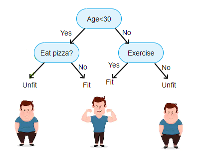
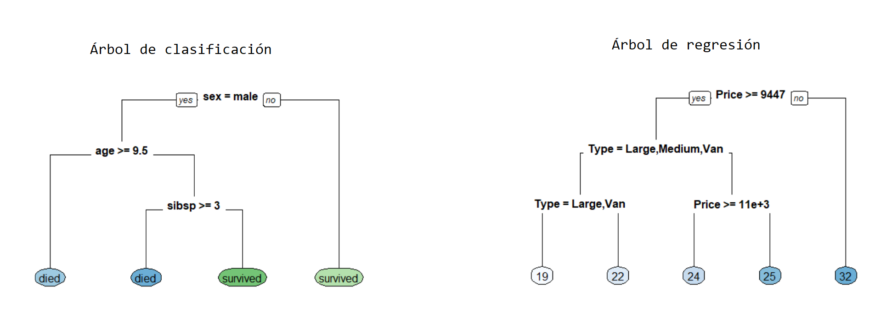
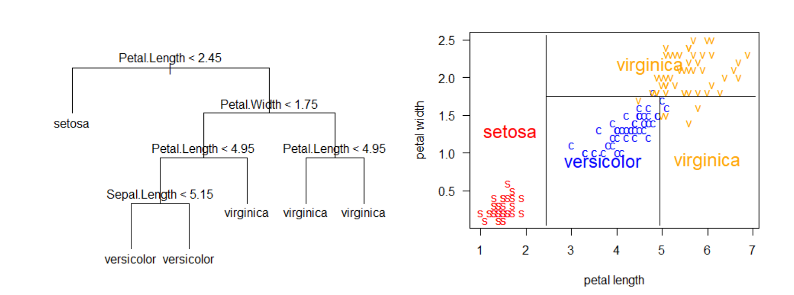

# Árboles de clasificación {#arb-de-clasif}
Los árboles de regresión/clasificación fueron propuestos por [Leo Breiman](https://en.wikipedia.org/wiki/Leo_Breiman) en el libro [@Breiman1984] y son árboles de decisión que tienen como objetivo predecir la variable respuesta $Y$ en función de covariables.

## Árboles {-}
A continuación la imagen de un árbol común.

<p align="center">
  
</p>

A continuación la imagen de un árbol seco e invertido.

<p align="center">
  
</p>

Esta forma invertida es la forma de los árboles de regresión y clasificación.

## Árbol de decisión {-}
Conjunto de reglas sucesivas que ayudan a tomar una decisión.

<p align="center">
  
</p>

## Tipos de árboles {-}
Los árboles se pueden clasificar en dos tipos que son:

1. Árboles de regresión en los cuales la variable respuesta $y$ es cuantitativa.
2. Árboles de clasificación en los cuales la variable respuesta $y$ es cualitativa.

<p align="center">
  
</p>

El presente capítulo está destinado a árboles de clasificación, los árboles de regresión se explican en el capítulo \@ref(arb-de-regre).

## Árbol de clasificación {-}
Un árbol de regresión consiste en hacer preguntas del tipo ¿$x_k \leq c$? para las covariables cuantitativas o preguntas del tipo ¿$x_k = \text{nivel}_j$? para las covariables cualitativas, de esta forma el espacio de las covariables es divido en hiper-rectángulos y todas las observaciones que queden dentro de un hiper-rectángulo tendrán el mismo valor grupo estimado.

En la siguiente figura se ilustra el árbol en el lado izquierdo y la partición del espacio en el lado derecho. La partición del espacio se hace de manera repetitiva para encontrar las variables y los valores de corte $c$ de tal manera que se minimice la función de costos $\sum_{i=1}^{i=n} (y_i - \hat{y}_i)^2$.

<p align="center">
  
</p>

## Paquetes de R para construir árboles {-}
Los paquetes más conocidos para construir árboles son:

- [tree](https://cran.r-project.org/web/packages/tree/index.html).
- [rpart](https://cran.r-project.org/web/packages/rpart/index.html).
- [party](https://cran.r-project.org/web/packages/party/index.html)

Existen otros paquetes que el lector puede consultar en la sección *Recursive Partitioning* de [CRAN Task View: Machine Learning & Statistical Learning](https://cran.r-project.org/web/views/MachineLearning.html).

## Ejemplo con **rpart** {-}

<p align="center">
  
</p>

La base de datos que vamos a usar en este ejemplo está disponible en el [UCI Repository](https://archive.ics.uci.edu/ml/datasets/Heart+Disease). El objetivo es crear un árbol de clasificación para predecir la variable $Y$ (`target`) definida como:

$$
Y=\left\{\begin{matrix}
1 \quad \text{si paciente SI sufre una enfermedad cardíaca} \\ 
0 \quad \text{si paciente NO sufre una enfermedad cardíaca}
\end{matrix}\right.
$$

en función de las variables `age` y `chol`.

Las variables en la base de datos son las siguientes:

1. Age: displays the age of the individual. 
2. Sex: displays the gender of the individual using the following format: 1 = male, 0 = female. 
3. Chest-pain type: displays the type of chest-pain experienced by the individual using the following format: 1 = typical angina, 2 = atypical angina, 3 = non — anginal pain, 4 = asymptotic.
4. Resting Blood Pressure: displays the resting blood pressure value of an individual in mmHg (unit)
5. Chol: displays the serum cholesterol in mg/dl (unit)
6. Fasting Blood Sugar: compares the fasting blood sugar value of an individual with 120mg/dl. If fasting blood sugar > 120mg/dl then : 1 (true)
else : 0 (false).
7. Resting ECG : displays resting electrocardiographic results: 0 = normal
1 = having ST-T wave abnormality, 2 = left ventricular hyperthrophy.
8. Max heart rate achieved: displays the max heart rate achieved by an individual.
9. Exercise induced angina: 1 = yes, 0 = no. 
10. ST depression induced by exercise relative to rest: displays the value which is an integer or float.
11. Peak exercise ST segment: 1 = upsloping, 2 = flat, 3 = downsloping. 
12. Number of major vessels (0–3) colored by flourosopy : displays the value as integer or float.
13. Thal: displays the thalassemia: 3 = normal, 6 = fixed defect, 7 = reversible defect.
14. Target: Diagnosis of heart disease. Displays whether the individual is suffering from heart disease or not: 0 = absence, 1, 2, 3, 4 = present.

La base de datos está en un repositorio en la web y se puede leer usando el siguiente código.

```{r message=FALSE}
library(readr)
url <- 'https://raw.githubusercontent.com/fhernanb/datos/master/cleveland.csv'
datos <- read_csv(url, col_names = FALSE)
```

Como la base de datos viene sin los nombres se deben colocar manualmente así:

```{r}
colnames(datos) <- c('age', 'sex', 'cp', 'trestbps', 'chol',
                     'fbs', 'restecg', 'thalach', 'exang', 
                     'oldpeak', 'slope', 'ca', 'thal', 'target')
```

La variable respuesta es `target` que tiene cuatro números así: 0 = absence, 1, 2, 3, 4 = present. Por esa razón vamos a crear la nueva variable `y` que agregaremos a la base de datos usando el siguiente código.

```{r}
datos$y <- ifelse(datos$target == 0, 'absence', 'presence')
datos$y <- as.factor(datos$y)
```

Nota: en orden lexicográfico la etiqueta `absence` está primero que `presence` porque inicia con la letra `a`. Eso significa que el árbol va a tomar la etiqueta `absence` como 0 mientras que `presence` la va a tomar como 1. 

Nota: se pudo haber creado la variable `y` usando `ifelse(datos$target == 0, 0, 1)` pero decidimos usar los nombres `absence` y `presence` en lugar del 0 y 1 para facilitar su interpretación.

¿Cuántos pacientes hay en la base de datos?

```{r}
nrow(datos)
```

¿Cuántos pacientes presentan la enfermedad y cuántos no?

```{r}
table(datos$y)
```

Ahora vamos a crear un diagrama de dispersión de `chol` versus `age` diferenciando por `y` para observar si hay algún patrón claro a nuestros ojos.

```{r}
library(ggplot2)
ggplot(datos, aes(x=age, y=chol, col=y)) +
  geom_point() + labs(x='Edad', y='Nivel colesterol')
```

Para crear el árbol de clasificación usaremos la función `rpart` del paquete __rpart__. Para obtener más detalles de este paquete se recomienda consultar las viñetas del paquete disponibles [en este enlace](https://cran.r-project.org/web/packages/rpart/index.html).

El código para crear el árbol es el siguiente.

```{r}
library(rpart)
mod1 <- rpart(y ~ age + chol, data=datos, method='class')
```

Para dibujar el árbol de clasificación podemos usar la función `rpart.plot` del paquete __rpart.plot__. Para obtener más detalles de este paquete se recomienda consultar la viñeta del paquete disponible [en este enlace](http://www.milbo.org/doc/prp.pdf).

```{r}
library(rpart.plot)
rpart.plot(mod1, type=0, extra=0,  
           box.palette = c("lightgreen", "pink"))
```

Si nos cuesta trabajo entender el árbol anterior podemos generar las reglas de clasificación en un lenguaje sencillo así:

```{r}
rpart.rules(mod1)
```

- La primera línea de la salida anterior nos dice que "P(presence) = 0.26 para pacientes cuyo perfil es menor de 55 años y colesterol menor de 274". 
- La última línea de la salida anterior nos dice que "P(presence) = 0.86 para pacientes cuyo perfil es mayor o igual a 64 años y colesterol entre 242 y 259".

Para construir la tabla de confusión usando los datos de entrenamiento podemos usar el siguiente código.

```{r}
y_hat <- predict(mod1, type='class')
tabla <- table(Verdadero=datos$y, Clasificacion=y_hat)
tabla
```

Para obtener la tasa de clasificación correcta podemos usar el siguiente código.

```{r}
sum(diag(tabla)) / sum(tabla)
```

Supongamos que nos llegaron 3 pacientes, el primero un hombre de 45 años con nivel de colesterol 300, el segundo una mujer de 60 años con nivel de colesterol de 450 y el tercero otro hombre de 65 años con nivel de colesterol de 200. ¿A qué grupo se debe asignar cada paciente?

```{r}
nuevo_df <- data.frame(age=c(45, 60, 65),
                       chol=c(300, 450, 200))

predict(mod1, newdata=nuevo_df, type='prob')
```

Si queremos obtener las etiquetas de clasificación podemos usar:

```{r}
predict(mod1, newdata=nuevo_df, type='class')
```

Supongamos que nos llegan 3 nuevos pacientes: el primero un hombre de 45 años pero no sabemos su nivel de colesterol, el segundo una mujer de edad desconocida y con nivel de colesterol de 450 y el tercero otro hombre del cual no sabemos ni su edad ni su nivel de colesterol. ¿A qué grupo se debe asignar cada paciente?

```{r}
nuevo_df <- data.frame(age=c(45, NA, NA),
                       chol=c(NA, 450, NA))

predict(mod1, newdata=nuevo_df, type='prob')
predict(mod1, newdata=nuevo_df, type='class')
```

## Ejemplo con **tree** {-}
Vamos a construir un árbol de clasificación para los mismos datos del ejemplo anterior pero usando la función `tree` del paquete `tree`.

```{r warning=FALSE}
library(tree)
mod2 <- tree(y ~ age + chol, data=datos)
```

Para dibujar el árbol.

```{r}
plot(mod2, type='uniform')
text(mod2)
```

Supongamos que nos llegaron 3 pacientes, el primero un hombre de 45 años con nivel de colesterol 300, el segundo una mujer de 60 años con nivel de colesterol de 450 y el tercero otro hombre de 65 años con nivel de colesterol de 200. ¿A qué grupo se debe asignar cada paciente?

```{r}
nuevo_df <- data.frame(age=c(45, 60, 65),
                       chol=c(300, 450, 200))

predict(mod2, newdata=nuevo_df, type='vector')
predict(mod2, newdata=nuevo_df, type='class')
```

## Ejemplo {-}
Comparemos los resultados obtenidos con las funciones `rpart` y `tree`.

```{r}
y_rpart <- predict(mod1, type='class')
y_tree  <- predict(mod2, type='class')

table(datos$y, y_rpart)
table(datos$y, y_tree)
```
