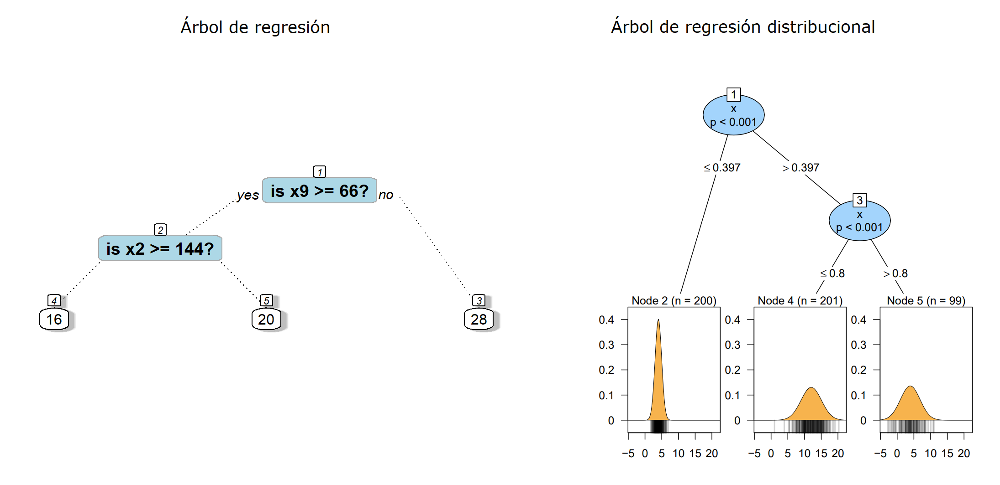
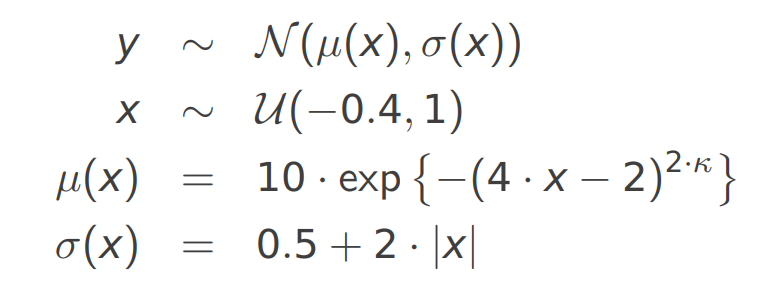

# Árboles de regresión distribucionales {#arb-distri}
Los árboles de regresión distribucionales fueron propuestos por @LisaSchlosser2020.

Abajo una comparación entre un árbol de regresión y un árbol de regresión distribucional.

<p align="center">
  
</p>

## Videos útiles  {-}

<p align="center">
<iframe width="560" height="315" src="https://www.youtube.com/embed/tzR9U-0j3s0" title="YouTube video player" frameborder="0" allow="accelerometer; autoplay; clipboard-write; encrypted-media; gyroscope; picture-in-picture; web-share" allowfullscreen></iframe>
</p>

## Paquete disttree  {-}

**distree** [@R-disttree] es un paquete de R para ajustar árboles y bosques de regresión distribucionales basado en la estimación de máxima verosimilitud de parámetros para familias de distribución específicas. Para instalar el paquete puedes usar el siguiente código.

```{r eval=FALSE}
install.packages("disttree", repos="http://R-Forge.R-project.org")
```

Para crear un árbol de regresión distribucional se usa la función `disttree` que tiene la siguiente estructura.

```{r eval=FALSE}
disttree(formula, data, subset, na.action = na.pass, weights, offset,
           cluster, family = NO(), control = disttree_control(...), 
           converged = NULL, scores = NULL, doFit = TRUE, ...)
```

El argumento `family` se utiliza para indicar la distribución estadística que se asume para la variable respuesta $Y$. Se puede elegir cualquier distribución del paquete **gamlss** [@R-gamlss] o cualquier distribución del paquete **RelDists** [@R-RelDists].

Una pregunta frecuente es ¿cómo selecciono la distribución que mejor explica el patrón de mi variable respuesta $Y$?

```{block2, type='rmdnote'}
Para encontrar las distribuciones que mejor explican a $Y$ se puede utilizar el procedimiento mostrado [en este documento](https://fhernanb.github.io/Manual-de-R/select_dist.html).
```

## Ejemplo {-}

Este ejemplo está basado en la figura 1.2 de la disertación de @LisaSchlosser2020. Aquí vamos a tener una variable respuesta $Y$ con distribución normal pero que depende de la variable auxiliar $X$.

 \begin{equation*}
  Y = \begin{cases}
        N(\mu=5, \sigma=1)   \, \text{si $x < 0.4$,} \\
        N(\mu=12, \sigma=2)  \, \text{si $0.4 \leq x \leq 0.8$,} \\
        N(\mu=0, \sigma=0.5) \, \text{si $x > 0.8$}.
      \end{cases}
 \end{equation*}

El siguiente código sirve para simular los datos.

```{r}
n <- 500
x <- runif(n=n)
y <- numeric(n)
y[x < 0.4]            <- rnorm(n=sum(x < 0.4), mean=5, sd=1)
y[x >+ 0.4 & x < 0.8] <- rnorm(n=sum(x >+ 0.4 & x < 0.8), mean=12, sd=2)
y[x >= 0.8]           <- rnorm(n=sum(x >= 0.8), mean=0, sd=0.5)

datos <- data.frame(y=y, x=x)
plot(x=x, y=y, ylim=c(-5, 20))
```

Vamos ahora a crear el árbol distribucional con `family=NO`.

```{r message=FALSE}
library(disttree)
mod <- disttree(y ~ x, data=datos, family=NO)
mod
plot(mod)
```

¿Cuál será el valor estimado de $Y$ para tres nuevos objetos que tiene valor de $x=0.35$, $x=0.47$ y $x=0.89$ respectivamente?

```{r}
new_data <- data.frame(x=c(0.35, 0.47, 0.89))
predicciones <- predict(mod, newdata=new_data)
predicciones
```

## Ejemplo {-}

Este ejemplo está basado en un ejemplo de [esta presentación](https://www.zeileis.org/papers/Psychoco-2018.pdf) de Achim Zeileis. El modelo estadístico para simular los datos es el siguiente:

<p align="center">
  
</p>

El siguiente código sirve para simular los datos.


