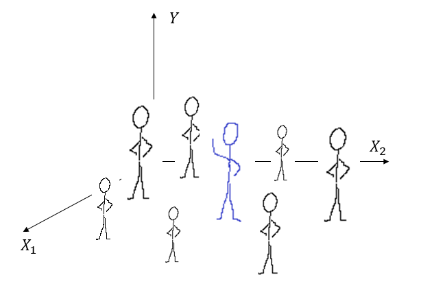
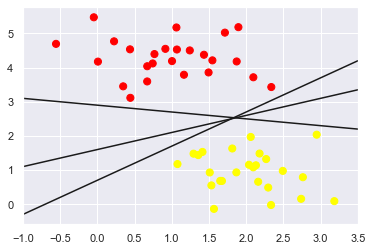
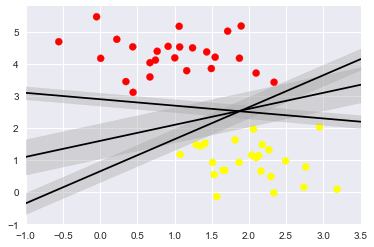
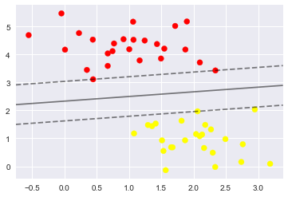
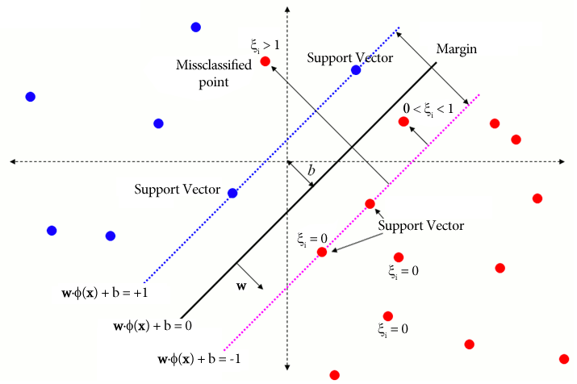

# knn {#knn-reg}
@Cortes1995 en el artículo titulado "Support-Vector Networks" propusieron las máquinas de soporte vectorial (svm) para el problema de clasificación.

Suponga que deseamos tenemos dos grupos de objetos, unos de color rojo y otros de color amarillo como se muestran en la siguiente figura.

  

El objetivo es dibujar una línea recta que separe los dos grupos, sin embargo, muchas líneas se podrían dibujar, a continuación se muestran tres posibles líneas con las cuales se consigue el objetivo.

  

Imaginemos que cada línea es como una carretera que se puede ampliar a ambos lados hasta que toque el punto más cercano, ya se amarillo o rojo. Al hacer esto vamos a obtener las tres carreteras que se muestran a continuación.

  

De todas las carreteras nos interesa aquella que tenga el mayor ancho o margen, con esa carretera es que se pueden clasificar nuevas observaciones en el grupo rojo o grupo amarillo. A continuación se muestra la figura sólo con la línea de separación que tiene el mayor ancho.

  

En la siguiente figura se muestra de manera más formal el objetivo de svm para clasificación en dos grupos.

  

El objetivo es encontrar $\boldsymbol{w}$ y $b$ para minimizar la función objetivo (FO) siguiente:

$$
\text{FO} = \frac{1}{2}  \left\lVert  \boldsymbol{w} \right\rVert ^2 + C \sum_{i=1}^{N} \xi_i,
$$

sujeta a $y_i (\boldsymbol{w}^\top \boldsymbol{x}_i) \geq 1$ para todo $i$.

## Paquetes de R para svm {-}
Los paquetes más conocidos para svm son:

- [e1071](https://cran.r-project.org/web/packages/e1071/index.html).
- [kernlab](https://cran.r-project.org/web/packages/kernlab/index.html).
- [klaR](https://cran.r-project.org/web/packages/klaR/index.html)
- [svmpath](https://cran.r-project.org/web/packages/svmpath/index.html)

Existen otros paquetes que el lector puede consultar en la sección *Support Vector Machines and Kernel Methods* [CRAN Task View: Machine Learning & Statistical Learning](https://cran.r-project.org/web/views/MachineLearning.html).

