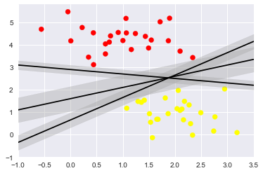

# Support Vector Machines para clasificación {#svm-clas}
@Cortes1995 propusieron las máquinas de soporte vectorial para el problema de clasificación.

Suponga que deseamos tenemos dos grupos de objetos, unos de color rojo y otros de color amarillo como se muestran en la siguiente figura.

```{r svmreg1, echo=F, fig.cap='Ilustración de la técnica Árboles de Regresión. A la izquierda el árbol y a la derecha la partición del espacio.', dpi=40, fig.align='center'}

```

El objetivo es dibujar una línea recta que separe los dos grupos, sin embargo, muchas líneas se podrían dibujar, a continuación se muestran tres posibles líneas con las cuales se consigue el objetivo.

```{r svmreg2, echo=F, fig.cap='espacio2.', dpi=40, fig.align='center'}
knitr::include_graphics("images/svm_2.png")
```

Imaginemos que cada línea es como una carretera que se puede ampliar a ambos lados hasta que toque el punto más cercano, ya se amarillo o rojo. Al hacer esto vamos a obtener las tres carreteras que se muestran a continuación.

```{r svmreg3, echo=F, fig.cap='espacio3.', dpi=40, fig.align='center'}

```

De todas las carreteras nos interesa aquella que tenga el mayor ancho o margen, con esa carretera es que se pueden clasificar nuevas observaciones en el grupo rojo o grupo amarillo. A continuación se muestra la figura sólo con la línea de separación que tiene el mayor ancho.

```{r svmreg4, echo=F, fig.cap='espacio4.', dpi=40, fig.align='center'}
knitr::include_graphics("images/svm_4.png")
```
