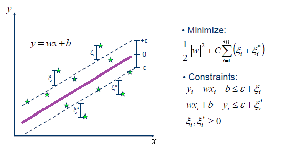

# Support Vector Machines para regresión {#svm-reg}
@Drucker97 en el artículo titulado "Support Vector Regression Machines" propusieron las máquinas de soporte vectorial (svm) para el problema de regresión.

En la siguiente figura (tomada de [link](https://www.saedsayad.com/support_vector_machine_reg.htm)) se ilustra la idea intuitiva para el caso de predecir $y$ usando una sola variable $x$.

  

El objetivo es construir un margen de tolerancia ($\varepsilon$) con el cual se tendrán observaciones dentro de los márgenes y fuera de los márgenes. Usando sólo las observaciones fuera de los márgenes, se calculan los errores $\xi$ o $\xi^\star$ y con ellos se construye la función de objetivo (FO) a minimizar

$$
\text{FO} = \frac{1}{2} \| \boldsymbol{w} \|^2 + C \sum_{i=1}^{N} (\xi_i + \xi^\star),
$$

donde $\boldsymbol{w}$ es el vector con las pendientes asociadas a cada una de las variables (sin incluir intercepto), $C$ es un valor de penalización para los errores y $m$ el número de observaciones que están fuera de los márgenes del total de $n$ observaciones.

## Paquetes de R para svm {-}
Los paquetes más conocidos para svm son:

- [e1071](https://cran.r-project.org/web/packages/e1071/index.html).
- [kernlab](https://cran.r-project.org/web/packages/kernlab/index.html).
- [klaR](https://cran.r-project.org/web/packages/klaR/index.html)

Existen otros paquetes que el lector puede consultar en la sección *Support Vector Machines and Kernel Methods* [CRAN Task View: Machine Learning & Statistical Learning](https://cran.r-project.org/web/views/MachineLearning.html).

## Ventajas {-}

Algunas de las ventajas de SVM según @shivaswamy2007 son:

- superior generalization capacity, 
- globally optimal solution from a convex optimization problem, 
- ability to handle non-linear problems using the so-called “kernel trick”, 
- sparseness of the solution which makes it possible to have specialized fast algorithms such as the sequential minimal optimization.

## Ejemplos {-}
A continuación se presentan los _scripts_ de varios ejemplos de svm. Se le recomienda al lector que descargue y experimente con los ejemplos.

- [Creando una svm manual](https://github.com/fhernanb/modelos-predictivos/blob/master/svm/Creando%20una%20svm%20manual%20para%20regresion.R).
- .
- .
- .

