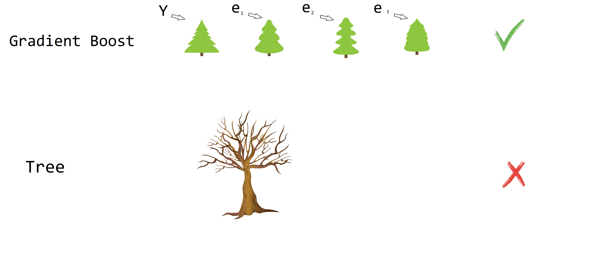

# Gradient Boost {#gradboost}

Gradient Boost fue propuesto por [@Friedman1999a] y [@Friedman1999b] y consiste en crear varios predictores en secuencia. El primer predictor usa la media de la variable $Y$ para predecir, luego el segundo predictor explica los errores del primer predictor, el tercer predictor explicar los erroes del segundo predictor y así sucesivamente. En la siguiente figura se muestra una ilustración de lo que es Gradient Boost.

<p align="center">
  
</p>

## Ejemplo {-}
Abajo se presenta un video con una explicación detallada de lo que es Gradient Boost.

<iframe width="560" height="315" src="https://www.youtube.com/embed/3CC4N4z3GJc" frameborder="0" allow="accelerometer; autoplay; encrypted-media; gyroscope; picture-in-picture" allowfullscreen></iframe>

## Ejemplo {-}
En este ejemplo se muestra como aplicar Gradient Boost de forma manual usando los datos del video anterior.

```{r}
height <- c(1.6, 1.6, 1.5, 1.8, 1.5, 1.4)
color <- c("blue", "green", "blue", "red", "green", "blue")
gender <- c("male", "female", "female", "male", "male", "female")
weigth <- c(88, 76, 56, 73, 77, 57)
```

La librería para crear los árboles será **rpart**.

```{r}
library(rpart)
```

El valor learning rate en el ejemplo será $\alpha=0.10$. A continuación el código para crear el modelo inicial y los modelos siguientes del video anterior.

```{r}
a <- 0.1 # Learning rate

# Modelo inicial
res1 <- weigth - mean(weigth)

# Modelo 2
mod2 <- rpart(res1 ~ height + color + gender,
              control=rpart.control(minsplit = 3))
res2 <- weigth - (mean(weigth) + a * predict(mod2))

# Modelo 3
mod3 <- rpart(res2 ~ height + color + gender,
              control=rpart.control(minsplit = 3))
res3 <- weigth - (mean(weigth) + a * predict(mod2) + a * predict(mod3))
```

A continuación una tabla con los residuales de los modelos.

```{r}
cbind(res1, res2, res3)
```

Para predecir el valor de weigth cuando height=1.7, color="green" y gender="male" se usa el siguiente código.

```{r}
new_data <- data.frame(height=1.7, 
                       color="green", 
                       gender="male")

mean(weigth) + a * predict(mod2, new_data) + a * predict(mod3, new_data)
```

