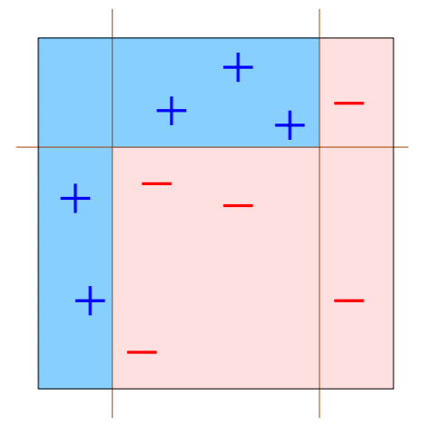

# AdaBoost {#adaboost}

AdaBoost (adaptive boosting) fue propuesto por [@freund_1995].


## Explicación sencilla para aplicar AdaBoost {-}

1. Entrene un clasificador.
2. Use el clasificador.
3. Identifique los casos que fueron mal clasificados.
4. Construya un nuevo clasificador que clasifique mejor los casos mal clasificados del punto anterior.
5. Repita los pasos 2 a 4 varias veces.
6. Asígnele un peso a cada clasificador y júntelos para obtener un clasificador con mejor desempeño.

## Explicación detallada para aplicar AdaBoost {-}

1. Inicie con un conjunto de entrenamiento $(X, Y)$ con $m$ observaciones denotadas como $(x_1, y_1), \ldots, (x_m, y_m)$ de tal manera que $x_i \in R^p$. Los valores de $y$ deben ser -1 o 1 para aplicar el método.
2. Inicie con la distribución discreta $D_1(i)=1/m$ que indica el peso de la observación $i$ en la iteración $1$.
3. Para $t=1, \ldots, T$.
  - Construya un clasificador $h_t$ definido así: $h_t : X \rightarrow \{-1, 1 \}$.
  - Calcule el error asociado $\epsilon_t$ al clasificador $\epsilon_t= \sum_{i=1}^m D_t(i) \times \delta_i$, donde $\delta_i=0$ si $h_t(x_i)=y_i$, es decir, si fue correcta la clasificación; caso contrario es $\delta_i=1$.
  - Calcule la nueva distribución $D_{t+1}(i)=D_{t}(i) \times F_i / Z_t$, donde:   
    - $F_i=\exp(-\alpha_t)$ si la clasificación fue correcta, es decir si $h_t(x_i) = y_i$.
    - $F_i=\exp(\alpha_t)$ si la clasificación fue incorrecta, es decir si $h_t(x_i) \neq y_i$.
    - $\alpha_t=\frac{1}{2} \log \left( \frac{1-\epsilon_t}{\epsilon_t} \right)$.
    - $Z_t$ es una constante de normalización de tal manera que $\sum_{i=1}^m D_t(i)=1$. Usualmente es $\sum D_{t}(i) \times F_i$.
3. Construya el clasificador final $H_{final}$ como el promedio ponderado de los $t$ clasificadores $h_t$, usando $H_{final}=sign(\sum_t \alpha_t h_t(x))$.

## Ejemplo {-}
En este ejemplo se ilustra la forma de 

```{r adaboost01, echo=F, fig.cap='Datos originales.', dpi=60, fig.align='center'}
knitr::include_graphics("images/adaboost01.png")
```

```{r adaboost02, echo=F, fig.cap='Clasificadores.', dpi=40, fig.align='center'}
knitr::include_graphics("images/adaboost02.png")
```

```{r adaboost03, echo=F, fig.cap='Obtención clasificador final.', dpi=40, fig.align='center'}
knitr::include_graphics("images/adaboost03.png")
```

```{r adaboost04, echo=F, fig.cap='Clasificador final.', dpi=70, fig.align='center'}

```

## Ejemplo {-}
En este ejemplo vamos a mostrar como usar el paquete **adabag** [@R-adabag] para aplicar AdaBoost.

Como ejemplo vamos a usar la base de datos `iris` en la cual se tienen 4 variables que ayudarán a clasificar nuevas flores en una de tres especies. En la figura de abajo se muestran las tres especies y las cuatro variables.

```{r iris, echo=F, fig.cap='Tipos de especies y variables en la base de datos iris.', dpi=90, fig.align='center'}
knitr::include_graphics("images/iris.png")
```

Primero vamos a crear un árbol de clasificación usando el paquete **rpart** [@R-rpart], este modelo servirá como referencia.

```{r}
library(rpart)
mod1 <- rpart(Species ~ ., data=iris)
yhat1 <- predict(mod1, type='class')
```

Ahora vamos a aplicar AdaBoost.

```{r message=FALSE}
library(adabag)
mod2 <- bagging(Species ~ ., data=iris, mfinal=20)
yhat2 <- predict(mod2, newdata=iris)$class
```

En los objetos `yhat1` y `yhat2` están las predicciones y con ellas vamos a formar las tablas de confusión para cada modelo.

```{r}
t1 <- table(real=iris$Species, prediccion=yhat1)
t1
t2 <- table(real=iris$Species, prediccion=yhat2)
t2
```

Ahora vamos a calcular la tasa de clasificación correcta para cada una de las tablas anteriores.

```{r}
sum(diag(t1)) / sum(t1)
sum(diag(t2)) / sum(t2)
```

De la anterior salida se observa que la tasa de clasificación correcta con un árbol tradicional es `r sum(diag(t1)) / sum(t1) * 100`% mientras que con AdaBoost es `r sum(diag(t2)) / sum(t2) * 100`%.

## Ejemplo {-}
La base de datos que vamos a usar en este ejemplo está disponible en el [UCI Repository](https://archive.ics.uci.edu/ml/datasets/Heart+Disease). 

La variable respuesta es `Target` codificada como 0 = si el paciente no sufrió un ataque cardiaco y como 1, 2, 3 o 4 si el paciente sufrió un ataque cardiaco. La variable se re-codificará con los valores de -1 y 1 así:

$$
Y=\left\{\begin{matrix}
1 \quad \text{si paciente SI sufre una enfermedad cardíaca} \\ 
-1 \quad \text{si paciente NO sufre una enfermedad cardíaca}
\end{matrix}\right.
$$

El objetivo es crear un árbol de clasificación para predecir la variable $Y$ (`target`).

Primero vamos a cargar los datos.

```{r}
library(readr)
url <- 'https://raw.githubusercontent.com/fhernanb/datos/master/cleveland.csv'
datos <- read_csv(url, col_names = FALSE)
colnames(datos) <- c('age', 'sex', 'cp', 'trestbps', 'chol',
                     'fbs', 'restecg', 'thalach', 'exang', 
                     'oldpeak', 'slope', 'ca', 'thal', 'target')
datos$yy <- ifelse(datos$target == 0, -1, 1)
```

Ahora vamos a aplicar el algoritmo descrito arriba con $T=3$.

```{r}
library(rpart)
m <- nrow(datos)
Dt <- rep(1/m, m) # D1

# Primer clasificador
mod1 <- rpart(yy ~ age + chol, weights=Dt, data=datos, 
              method='class', control=rpart.control(maxdepth = 1))
y_hat <- predict(mod1, type='class')
error <- ifelse(y_hat == datos$yy, 0, 1)
epsilon_t <- sum(error * Dt)
alpha_t <- 0.5 * log((1-epsilon_t)/epsilon_t)
alpha1 <- alpha_t
Fi <- ifelse(y_hat == datos$yy, exp(-alpha_t), exp(alpha_t))
Dt <- Dt * Fi
Dt <- Dt / sum(Dt)

# Segundo clasificador
mod2 <- rpart(yy ~ age + chol, weights=Dt, data=datos, 
              method='class', control=rpart.control(maxdepth = 1))
y_hat <- predict(mod2, type='class')
error <- ifelse(y_hat == datos$yy, 0, 1)
epsilon_t <- sum(error * Dt)
alpha_t <- 0.5 * log((1-epsilon_t)/epsilon_t)
alpha2 <- alpha_t
Fi <- ifelse(y_hat == datos$yy, exp(-alpha_t), exp(alpha_t))
Dt <- Dt * Fi
Dt <- Dt / sum(Dt)

# Tercer clasificador
mod3 <- rpart(yy ~ age + chol, weights=Dt, data=datos, 
              method='class', control=rpart.control(maxdepth = 1))
y_hat <- predict(mod3, type='class')
error <- ifelse(y_hat == datos$yy, 0, 1)
epsilon_t <- sum(error * Dt)
alpha_t <- 0.5 * log((1-epsilon_t)/epsilon_t)
alpha3 <- alpha_t
Fi <- ifelse(y_hat == datos$yy, exp(-alpha_t), exp(alpha_t))
Dt <- Dt * Fi
Dt <- Dt / sum(Dt)
```

El clasificador final está definido como $H_{final}=sign(\sum_t \alpha_t h_t(x))$ y para obtenerlo en R usamos las siguientes instrucciones.

```{r}
y_hat1 <- ifelse(predict(mod1, type='class') == '-1', -1, 1)
y_hat2 <- ifelse(predict(mod2, type='class') == '-1', -1, 1)
y_hat3 <- ifelse(predict(mod3, type='class') == '-1', -1, 1)
y_final <- sign(alpha1 * y_hat1 + alpha2 * y_hat2 + alpha3 * y_hat3)
```

Para ver las primeras clasificaciones usarmos

```{r}
head(y_final)
```

```{r}
tabla1 <- table(y_hat1, datos$yy)
tabla2 <- table(y_hat2, datos$yy)
tabla3 <- table(y_hat3, datos$yy)
tabla_final <- table(y_final, datos$yy)

sum(diag(tabla1)) / nrow(datos)
sum(diag(tabla2)) / nrow(datos)
sum(diag(tabla3)) / nrow(datos)
sum(diag(tabla_final)) / nrow(datos)
```


