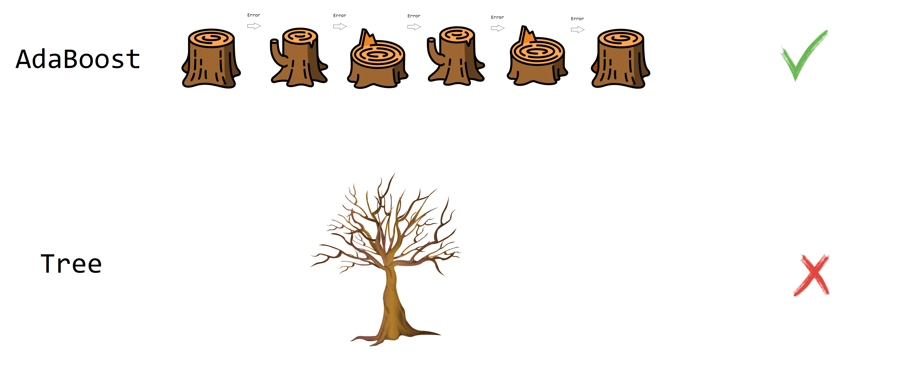
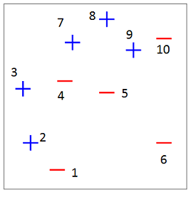
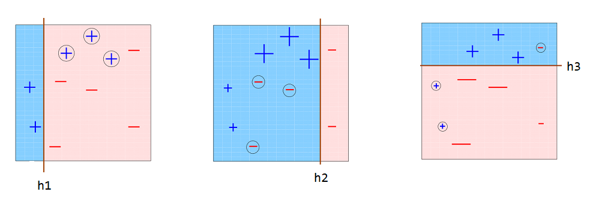
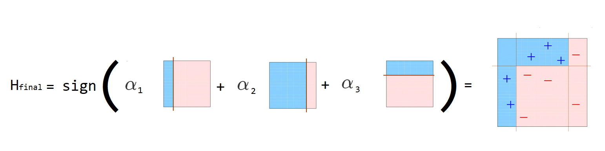

# AdaBoost {#adaboost}

AdaBoost (adaptive boosting) fue propuesto por [@freund_1995] y consiste en crear varios predictores sencillos en secuencia, de tal manera que el segundo ajuste bien lo que el primero no ajustó, que el tercero ajuste un poco mejor lo que el segundo no pudo ajustar y así sucesivamente. En la siguiente figura se muestra una ilustración de lo que es AdaBoost.

```{r adaboost00, echo=F, fig.cap='Ilustracion de AdaBoost.', dpi=70, fig.align='center'}

```


## Explicación sencilla de AdaBoost {-}

1. Entrene un clasificador.
2. Use el clasificador.
3. Identifique los casos que fueron mal clasificados.
4. Construya un nuevo clasificador que clasifique mejor los casos mal clasificados del punto anterior.
5. Repita los pasos 2 a 4 varias veces.
6. Asígnele un peso a cada clasificador y júntelos para obtener un clasificador con mejor desempeño.

## Explicación detallada de AdaBoost {-}

1. Inicie con un conjunto de entrenamiento $(X, Y)$ con $m$ observaciones denotadas como $(x_1, y_1), \ldots, (x_m, y_m)$ de tal manera que $x_i \in R^p$. Los valores de $y$ deben ser -1 o 1 para aplicar el método.
2. Inicie con la distribución discreta $D_1(i)=1/m$ que indica el peso de la observación $i$ en la iteración $1$.
3. Para $t=1, \ldots, T$.
  - Construya un clasificador $h_t$ definido así: $h_t : X \rightarrow \{-1, 1 \}$.
  - Calcule el error asociado $\epsilon_t$ al clasificador $\epsilon_t= \sum_{i=1}^m D_t(i) \times \delta_i$, donde $\delta_i=0$ si $h_t(x_i)=y_i$, es decir, si fue correcta la clasificación; caso contrario es $\delta_i=1$.
  - Calcule la nueva distribución $D_{t+1}(i)=D_{t}(i) \times F_i / Z_t$, donde:   
    - $F_i=\exp(-\alpha_t)$ si la clasificación fue correcta, es decir si $h_t(x_i) = y_i$.
    - $F_i=\exp(\alpha_t)$ si la clasificación fue incorrecta, es decir si $h_t(x_i) \neq y_i$.
    - $\alpha_t=\frac{1}{2} \log \left( \frac{1-\epsilon_t}{\epsilon_t} \right)$.
    - $Z_t$ es una constante de normalización de tal manera que $\sum_{i=1}^m D_t(i)=1$. Usualmente es $\sum D_{t}(i) \times F_i$.
3. Construya el clasificador final $H_{final}$ como el promedio ponderado de los $t$ clasificadores $h_t$, usando $H_{final}=sign(\sum_t \alpha_t h_t(x))$.

## Ejemplo {-}
En este ejemplo se ilustra la forma de aplicar AdaBoost a un conjunto de datos bivariados para clasificar en dos clases: -1 y +1.

```{r adaboost01, echo=F, fig.cap='Datos originales.', dpi=60, fig.align='center'}

```

En la siguiente figura se muestran 3 clasificadores ($h_1$, $h_2$ y $h_3$) sencillos o árboles de profundidad uno (tocones), que fueron creados de forma secuencial. Al observar $h1$, se nota que él clasificó mal los + encerrados en círculos. Por esa razón, en la siguiente iteración esas observaciones mal clasificadas tuvieron un mayor peso o importancia en el nuevo clasificador $h_2$, por eso es que esos símbolos + aparecen más grandes en la segunda figura. Al mirar el clasificador $h_2$ se observa que logró clasificar bien esos + grandes, sin embargo, él clasificó mal los - que están encerrados en círculos. Por esa razón, en la siguiente iteración esas observaciones mal clasificadas tuvieron un mayor peso o importancia en el nuevo clasificador $h_3$, por eso es que esos símbolos - aparecen más grandes en la tercera figura. El clasificador $h_3$ logra clasificar mejor esos -.

```{r adaboost02, echo=F, fig.cap='Clasificadores.', dpi=40, fig.align='center'}

```

El clasificador final ($h_{final}$) se construye como una ponderación de los clasificadores sencillos ($h_1$, $h_2$ y $h_3$) como se muestra a continuación.

```{r adaboost03, echo=F, fig.cap='Obtención clasificador final.', dpi=40, fig.align='center'}

```

Los valores de $\alpha_t$ son las ponderaciones que aparecen en la explicación detallada del método.

## Ejemplo {-}
En este ejemplo vamos a usar la base de datos `kyphosis` del paquete **rpart** [@R-rpart]. A continuación las primeras líneas de la base de datos.

```{r}
library(rpart)
head(kyphosis)
```

El objetivo es crear un clasificador que use la información de Age, Number y Start para predecir el tipo de deformación kyphosis (absent or present). Como vamos a aplicar el AdaBoost manual debemos crear la variable respuesta en -1 y 1 así:

```{r}
kyphosis$y <- ifelse(kyphosis$Kyphosis == 'absent', -1, 1)
```

Vamos a crear primero un modelo de referencia `mod0` que será un árbol tradicional.

```{r}
mod0 <- rpart(y ~ Age + Number + Start, data=kyphosis, method='class')
y0 <- predict(mod0, type='class')
tabla0 <- table(y0, kyphosis$y)
sum(diag(tabla0)) / sum(tabla0)
```

En el siguiente código se usarán 20 iteraciones del AdaBoost en forma manual para crear 20 tocones (stumps) que unidos nos permitirán clasificar.

```{r}
T <- 20 # numero de iteraciones
m <- nrow(kyphosis)
Dt <- rep(1/m, m) # D1
alphas <- numeric(T) # Para almacenar alpha
y_hats <- matrix(NA, ncol=T, nrow=m) # Para almacenar la predicciones

for (i in 1:T) {
  mod <- rpart(y ~ Age + Number + Start, weights=Dt, data=kyphosis, 
               method='class', control=rpart.control(maxdepth = 1))
  y_hat <- predict(mod, type='class')
  error <- ifelse(y_hat == kyphosis$y, 0, 1) # 1=error, 0=ok
  epsilon_t <- sum(error * Dt)
  alpha_t <- 0.5 * log((1-epsilon_t)/epsilon_t)
  Fi <- ifelse(y_hat == kyphosis$y, exp(-alpha_t), exp(alpha_t))
  Dt <- Dt * Fi
  Dt <- Dt / sum(Dt)
  alphas[i] <- alpha_t
  y_hats[, i] <- ifelse(y_hat == '-1', -1, 1)
}
```

Para obtener las estimaciones con los 20 tocones se usa el siguiente código.

```{r}
y_final <- c(sign(y_hats %*% matrix(alphas, ncol=1)))
tabla_final <- table(y_final, kyphosis$y)
sum(diag(tabla_final)) / sum(tabla_final)
```

Por último vamos a usar la función `boosting` del paquete **adabag** [@R-adabag] para aplicar AdaBoost de forma automática.

```{r message=FALSE}
library(adabag)
adaboost <- bagging(Kyphosis ~ Age + Number + Start,
                    coeflearn='Freund',
                    data=kyphosis, mfinal=20)
yhat_adaboost <- predict(adaboost, newdata=kyphosis)$class
tabla_adaboost <- table(yhat_adaboost, kyphosis$Kyphosis)
sum(diag(tabla_adaboost)) / sum(tabla_adaboost)
```

Abajo se muestra nuevamente el código para calcular las tres tasas de clasificación correcta para el modelo de referencia, el AdaBoost manual y el AdaBoost automático.

```{r}
sum(diag(tabla0)) / sum(tabla0)
sum(diag(tabla_final)) / sum(tabla_final)
sum(diag(tabla_adaboost)) / sum(tabla_adaboost)
```

De la salida anterior se observa que el árbol tradicional tiene tasa de clasificación correcta menor que las dos versiones de AdaBoost.

## Ejemplo {-}
En este ejemplo vamos a mostrar como usar el paquete **adabag** [@R-adabag] para aplicar AdaBoost.

Como ejemplo vamos a usar la base de datos `iris` en la cual se tienen 4 variables que ayudarán a clasificar nuevas flores en una de tres especies. En la figura de abajo se muestran las tres especies y las cuatro variables.

```{r iris, echo=F, fig.cap='Tipos de especies y variables en la base de datos iris.', dpi=90, fig.align='center'}

```

Primero vamos a crear un árbol de clasificación usando el paquete **rpart** [@R-rpart], este modelo servirá como modelo de referencia. Para ajustar este modelo sólo vamos a usar las variables Sepal.Length y Sepal.Width
.
```{r}
library(rpart)
mod1 <- rpart(Species ~ Sepal.Length + Sepal.Width, data=iris)
yhat1 <- predict(mod1, type='class')
```

Ahora vamos a aplicar AdaBoost.

```{r message=FALSE}
library(adabag)
mod2 <- bagging(Species ~ Sepal.Length + Sepal.Width, 
                data=iris, mfinal=10)
yhat2 <- predict(mod2, newdata=iris)$class
```

En los objetos `yhat1` y `yhat2` están las predicciones y con ellas vamos a formar las tablas de confusión para cada modelo.

```{r}
t1 <- table(real=iris$Species, prediccion=yhat1)
t1
t2 <- table(real=iris$Species, prediccion=yhat2)
t2
```

Ahora vamos a calcular la tasa de clasificación correcta para cada una de las tablas anteriores.

```{r}
sum(diag(t1)) / sum(t1)
sum(diag(t2)) / sum(t2)
```

De la anterior salida se observa que la tasa de clasificación correcta con un árbol tradicional es `r sum(diag(t1)) / sum(t1) * 100`% mientras que con AdaBoost es `r sum(diag(t2)) / sum(t2) * 100`%.
